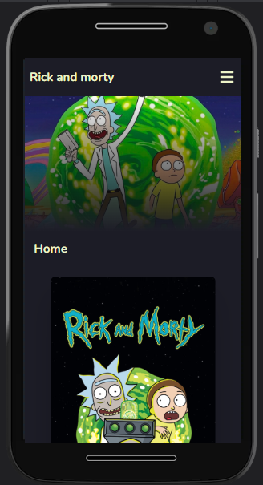

# Rick and morty page

<table>
<tr>
<td>
Rick and Morty page is an app for look characters cards, save in favorite and shared with friends.
</td>
</tr>
</table>

## Site


#### Get started

Install dependencies
```
  cd rick-and-morty
  npm install or yard install
```
Run project
```
  npm run dev
```
or
```
  yarn dev
```
## Demo

Here is a working live demo : https://rick-and-morty-lbjs.vercel.app/

## API

Rick and Morty API :  https://rickandmortyapi.com/

## Construido con 🛠️

* [TypeScript](https://www.typescriptlang.org/docs/)
* [Tailwind](https://tailwindcss.com/)
* [DaisyUI](https://daisyui.com/)
* [Axios](https://axios-http.com/)
* [Redux toolkit](https://redux-toolkit.js.org/)
* [React router ](https://reactrouter.com/en/main)
* [React icons](https://react-icons.github.io/react-icons)
* [react-helmet-async](https://www.npmjs.com/package/react-helmet-async)
* [Vite](https://vitejs.dev/)


